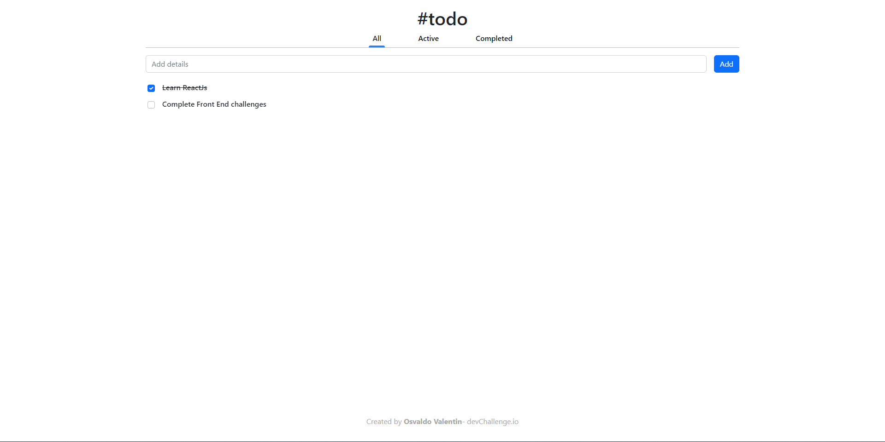

<h1 align="center">Todo App by Osvaldo Valentin</h1>

<div align="center">
   Solution for a challenge from  <a href="http://devchallenges.io" target="_blank">Devchallenges.io</a>.
</div>

<div align="center">
  <h3>
    <a href="https://todo-app-lyart-chi.vercel.app/">
      Demo
    </a>
    <span> | </span>
    <a href="https://github.com/ValentinOsvaldo/todo-app">
      Solution
    </a>
    <span> | </span>
    <a href="https://devchallenges.io/challenges/hH6PbOHBdPm6otzw2De5">
      Challenge
    </a>
  </h3>
</div>

## Table of Contents

- [Overview](#overview)
  - [Built With](#built-with)
- [Features](#features)
- [How to use](#how-to-use)
- [Contact](#contact)
- [Acknowledgements](#acknowledgements)

## Overview



I learned to use the useContext hook, to store the data use the localStorge API. Use React Router DOM for navigation to give a better experience and combine it with animate.style animations.

### Built With

- [vite](https://vitejs.dev/)
- [React](https://reactjs.org/)
- [useContext](https://reactjs.org/docs/hooks-reference.html#usecontext)
- [ReactRouter](https://reactrouter.com/)
- [Bootstrap](https://getbootstrap.com/)
- [Animate.css](https://animate.style/)
- localStorage API

## Features

This application/site was created as a submission to a [DevChallenges](https://devchallenges.io/challenges) challenge. The [challenge](https://devchallenges.io/challenges/hH6PbOHBdPm6otzw2De5) was to build an application to complete the given user stories.

## How To Use

To clone and run this application, you'll need [Git](https://git-scm.com) and [Node.js](https://nodejs.org/en/download/) (which comes with [npm](http://npmjs.com)) installed on your computer. From your command line:

```bash
# Clone this repository
$ git clone https://github.com/ValentinOsvaldo/todo-app.git

# Install dependencies
$ yarn

# Run the app
$ yarn dev
```

## Acknowledgements

- [Steps to replicate a design with only HTML and CSS](https://devchallenges-blogs.web.app/how-to-replicate-design/)
- [Node.js](https://nodejs.org/)
- [Marked - a markdown parser](https://github.com/chjj/marked)

## Contact

- Website [ovalentin.dev](https://ovalentindev.vercel.app/)
- GitHub [@ValentinOsvaldo](https://github.com/ValentinOsvaldo)
